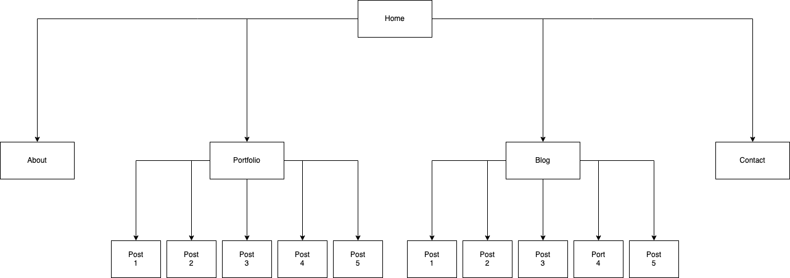

# Portfolio Website

Here is the link to the published portfolio site:  
https://carminafamilar.netlify.app/

<br>

## Purpose

This a portfolio website where Carmina Familar can showcase her skills and projects as a software developer. It allwos prospective recruiters and employers to view her resume and to contact her if they are interested in working with her in the future.

## Technology
- This static site made using HTML and CSS. 
- Where possible, semantic HTML tags were utilised for better readability and accessability. 
- CSS files are generated using SCSS and SASS. 
- To create site responsiveness for different screen sizes, media queries, breakpoints and units such as viewport widths (vw) were utilized.

## Sitemap
Below is the sitemap displaying the heirarchy of the site:  


   


## Pages

### Home
This contains a brief description of Carmina Familar as a software developer. It is saved in the index.html file. The two buttons right below this description allows for an immediate call to action: the "View Portfolio" button and the "Download Resume" button.

The HTML code for these buttons are shown below:
```html
<section class="button-items">  
    <a href="./pages/portfolio.html">
        <button class="home-section-button">View Portfolio</button>
    </a>
    <a href="./files/Carmina's Resume.pdf" download>
        <button class="home-section-button">Download Resume</button>
    </a>
</section>
```
The homepage also displays a preview of her projects and blog posts.

### About
The "About" page outlines in more detail Carmina Familar's expertise in software development. It is accompanied by multiple images to keep the target audience engaged.

### Portfolio
This page showcases Carmina Familar's previous software development works including projects from her studies at 42 Adelaide and Coder Academy. Each project is contained within a card. Each post also has an image with alternative text for those using screen readers. Clicking on the title of a project redirects you to that project's individual page.

### Blog
The blog page showcases Carmina's personality and interests. Simililar to the portfolio page, each post is represented as one card. This is contained within an article tag. Each article title links to its respective individual blog post page. The code for each post are as follows:

```html
<article class="post-container">
    <section class="post">
        
        <h4>
            <a href="../pages/blog/transitioning-from-teaching-to-software-development.html">
                Title
            </a>
        </h4>
        <p>Lorem ipsum dolor sit amet consectetur adipisicing elit.</p>
    </section>
</article>
```

### Contact
The contact page contains a simple form where the user can send a message to Carmina. The email field allows the developer to reply to the user. As this is a static ste for now, the submit button is currently a placeholder and is non-functional.

## Components
### Header
On desktop, the navigation bar appears on the top-right of the page horizontally to utilise the wider space. On tablets and mobile, it collapses to a hamburger menu. This is created using a checkbox input using the HTML code below. The styling can be found in the src/styles/components/_header.scss file

HTML:

```html
<nav class="navbar">
    <input type="checkbox" class="toggle-menu"/>
    <section class="hamburger"></section>
    <ul class="menu">
        <li><a href="./pages/about.html">ABOUT</a></li>
        <li><a href="./pages/portfolio.html">PORTFOLIO</a></li>
        <li><a href="./pages/blog.html">BLOG</a></li>
        <li><a href="./pages/contact.html">CONTACT</a></li>
    </ul>
</nav> 

```

### Footer
The footer contains the same navigation links as the header so the user does not have to scroll go back up to the top of the page to navigate the site. It also contains links to Carmina's LinkedIn and Github accounts. This is represented using Font Awesome icons with added alt-text for better accessability for screen readers. Below is an example:

```html
<section class="social-media-logos">
    <a href="https://github.com/CarminaF" target="_blank">
        <i class="fab fa-github fa-3x" alt="Github Link"></i>
    </a>
    <a href="https://www.linkedin.com/in/carmina-familar/" target="_blank">
        <i class="fa-brands fa-linkedin fa-3x" alt="LinkedIn Link"></i>
    </a>
</section>
```

## Defaults
All global variables such as breakpoints and fonts and colors consistently used throughout the site are stored in the "defaults" directory. 

