# Portfolio Website

Here is the link to the published portfolio site:  
https://carminafamilar.netlify.app/

GitHub repository:  
https://github.com/CarminaF/CarminaFamilar_T1A2_Portfolio

Walkthrough video link was in the README submitted to CoderAcademy.

<br>

## Purpose

This a portfolio website where Carmina Familar can showcase her skills and projects as a software developer. It allows prospective recruiters and employers to view her resume and to contact her if they are interested in working with her in the future.

<br>

## Technology
- The wire-frame was first designed using Figma.
- This static site was made using HTML and CSS. 
- 100% semantic HTML tags were utilized for better readability and accessability.
- CSS files were generated using SCSS and SASS. 
- Where possible, @mixins were used in CSS to adhere to the DRY (Don't Repeat Yourself) coding principles
- Visual Studio Code was the IDE for the project with the following extensions used for efficiency
    - Emmet to shortcut the creation of multiple HTML elements with class names
    - Watch SASS to automatically generate the CSS from the SCSS files. 
    - Live Server to immediately view the site interface and styling on your browser 
- To create site responsiveness for different screen sizes, media queries, breakpoints and units such as viewport widths (vw) and percentages were utilized.
- Relative links were used throughout the site rather than absolute links.
- The website's repository uses git as version control and is stored on GitHub.
- The site is deployed onto the Internet using Netlify.
- Netlify is using the "src" directory inside the GitHub repo.


<br>

## Sitemap
Below is the sitemap displaying the hierarchy of the site:  


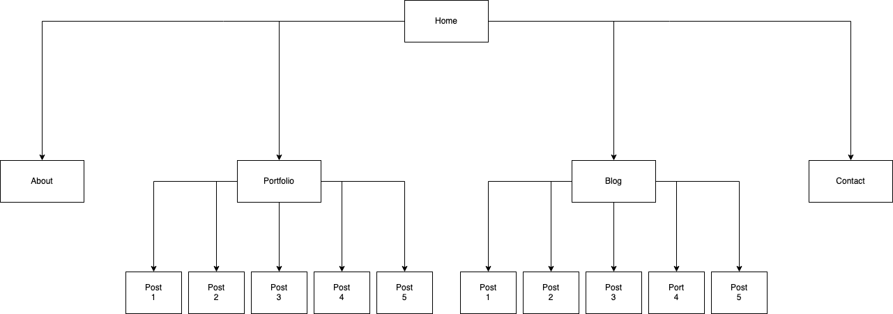   


<br>

## Wire-frame  
The wire-frame design process involved a mobile-first design approach without color or images to determine the layout first. The design for tablets and desktop came after the the mobile design as it is much easier to fit smaller components into a larger screen than the other way around. The colors and images were added later during the coding process.

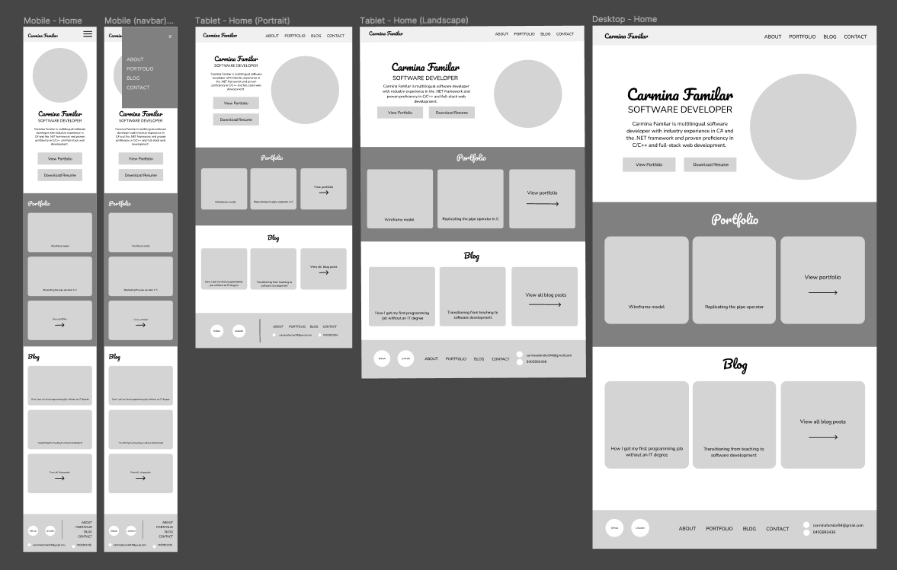

<br>

## Pages

<br>

### Home
This page contains a brief description of Carmina Familar as a software developer. The elements are saved in the index.html file and the styling in the home.css file. The two buttons right below this description allows for an immediate call to action: the "View Portfolio" button and the "Download Resume" button.

The HTML code for these buttons are shown below:
```html
<section class="button-items">  
    <a href="./pages/portfolio.html">
        <button class="home-section-button">View Portfolio</button>
    </a>
    <a href="./files/Carmina's Resume.pdf" download>
        <button class="home-section-button">Download Resume</button>
    </a>
</section>
```
The homepage also displays a preview of her projects and blog posts using cards. The cards are displayed using flex-box. On smaller screens, the cards have a column flex-direction due to the narrower but longer space and on wider screens it is a row flex-direction to utilize the wider space. I have also created an empty-child card at the end of the elements so that on tablets, the remaining card that has wrapped onto the next row aligns to the left and not center.

Mobile:

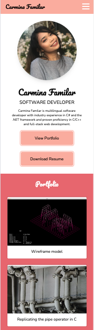

Tablet:  
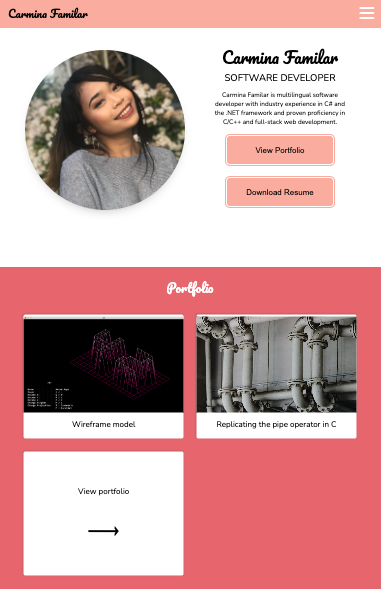

Desktop:  
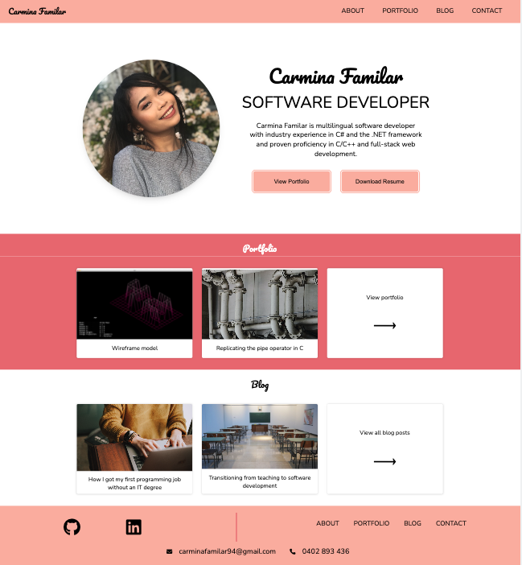

### About
The "About" page outlines in more detail Carmina Familar's expertise in software development. It is accompanied by multiple images to keep the target audience engaged. This page also utilizes a flex display. Each image is contained within a figure tag and the text is contained within an article tag. Utilizing these semantic tags creates better accessability than using a div tag. These two elements are then contained within a section tag in order to manipulate the flex direction of the second row (aka the :nth-child(2) pseudo class) to row-reverse on tablet and desktop to create an alternating image and text box pattern.

Mobile:  
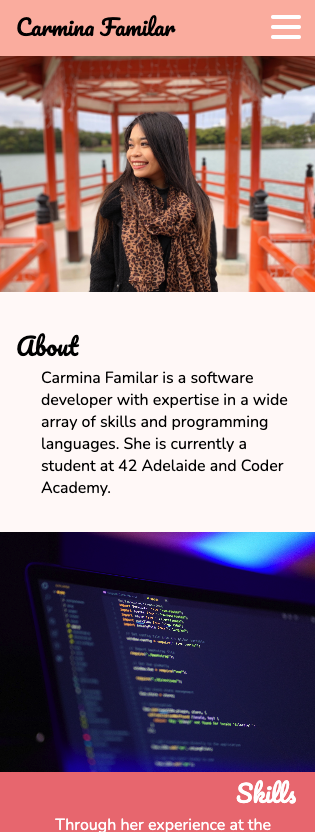

Tablet/Desktop: 
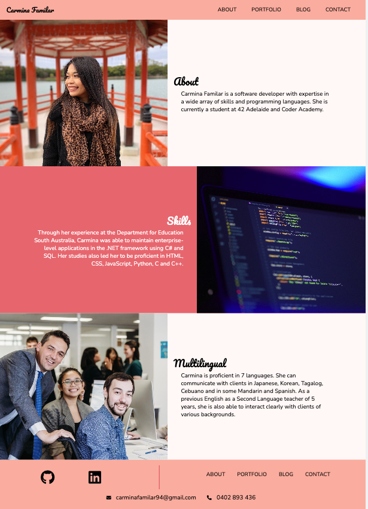 

### Portfolio
This page showcases Carmina Familar's previous software development works including projects from her studies at 42 Adelaide and Coder Academy. Each project is contained within a card which is contained in a bigger container with a translucent pink color to create visual interest. Each post also has an image with alternative text for those using screen readers. Clicking on the title of a project redirects you to that project's individual page. There is also an empty-child card at the end of the elements so that on tablets, the remaining card aligns left and not center.

### Blog
The blog page showcases Carmina's personality and interests. Similar to the portfolio page, it also utilizes a flex display with and empty-child flex-item for alignment and each post is represented as one card. This is contained within an article tag which is contained within a big pink container. Each article title links to its respective individual blog post page. The code for each post are as follows:

```html
<article class="post-container">
    <section class="post">
        
        <h4>
            <a href="../pages/blog/transitioning-from-teaching-to-software-development.html">
                Title
            </a>
        </h4>
        <p>Lorem ipsum dolor sit amet consectetur adipisicing elit.</p>
    </section>
</article>
```

### Contact
The contact page contains a simple form where the user can send a message to Carmina. On mobile it is one column and the big title is displayed at the top. On desktop however, there is a line separator that appears and it has two columns where the title is on the left column and the form is on the right. This was also manipulated using flex-box. The email field allows the developer to reply to the user. As this is a static ste for now, the submit button is currently a placeholder and is non-functional.

Mobile/Tablet:  
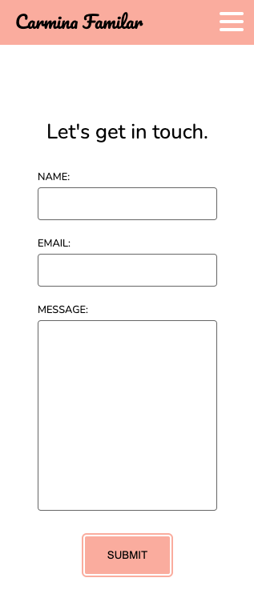

Desktop:
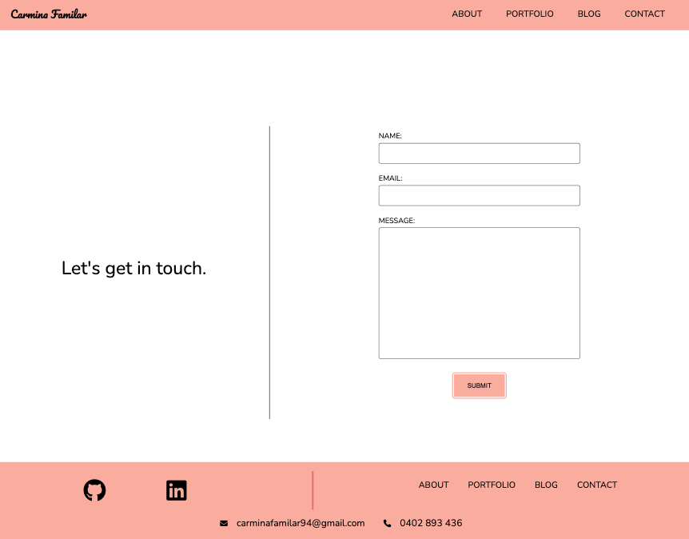   

<br>

## Components
### Header
The header is displayed horizontally in pink at the top of the page. It is contained within a header tag to add semantics and better readability. 

On desktop, the navigation bar appears on the top-right of the page horizontally to utilize the wider space. It is also animated so that on hover, each text link turns white and the background turns to a darker pink color whit an inset box shadow. 

On mobile, the header has a sticky display so that the menu can be easily reached. The menu collapses to a hamburger menu on mobile. This is created using a checkbox input using the HTML code below. The hamburger menu lines are created using the :before and :after pseudo classes to create three white lines with border-radiuses in CSS. This is so that the HTML file is not too cluttered. When the input is clicked, the middle bar disappears and the top and bottom bars rotate in opposing directions to create an "x" button animation. The CSS code for the checked hamburger menu are as follows:  

```css
input:checked ~ .hamburger {
    background: transparent;
}
input:checked ~ .hamburger::before {
    top: 0;
    transform: rotate(45deg);
}
input:checked ~ .hamburger::after {
    top: 0;
    transform: rotate(-45deg);
} 
```

Mobile view with hamburger menu input unchecked:   
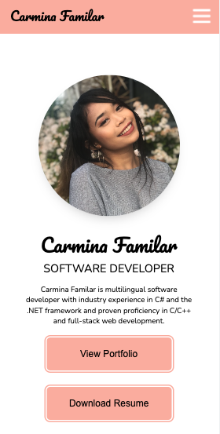

Mobile view with hamburger menu input checked:  
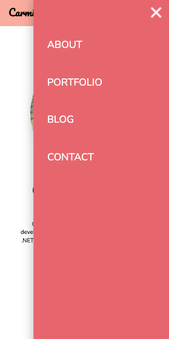

### Footer
The footer contains the same navigation links as the header so the user does not have to scroll go back up to the top of the page to navigate the site. Similar to the header, when the user hovers on the links and social media logos on desktop, there will be an animation where the text translates upwards and a white inset box shadow appears. The footer also contains links to Carmina's LinkedIn and Github accounts. This is represented using Font Awesome icons with added alt-text for better accessability for screen readers. Below is an example:

```html
<section class="social-media-logos">
    <a href="https://github.com/CarminaF" target="_blank">
        <i class="fab fa-github fa-3x" alt="Github Link"></i>
    </a>
    <a href="https://www.linkedin.com/in/carmina-familar/" target="_blank">
        <i class="fa-brands fa-linkedin fa-3x" alt="LinkedIn Link"></i>
    </a>
</section>
```

## Defaults
This directory contains private SCSS files only. All files containing global variables such as breakpoints, fonts and colors consistently used throughout the site are stored in this "defaults" directory.  The breakpoints file utilizes bootstrap sizes of "small" (for tablet) and "medium" (laptop) screens.

## Images
All images used within the site are contained in the images directory to adhere to the separation of concerns design principle.

